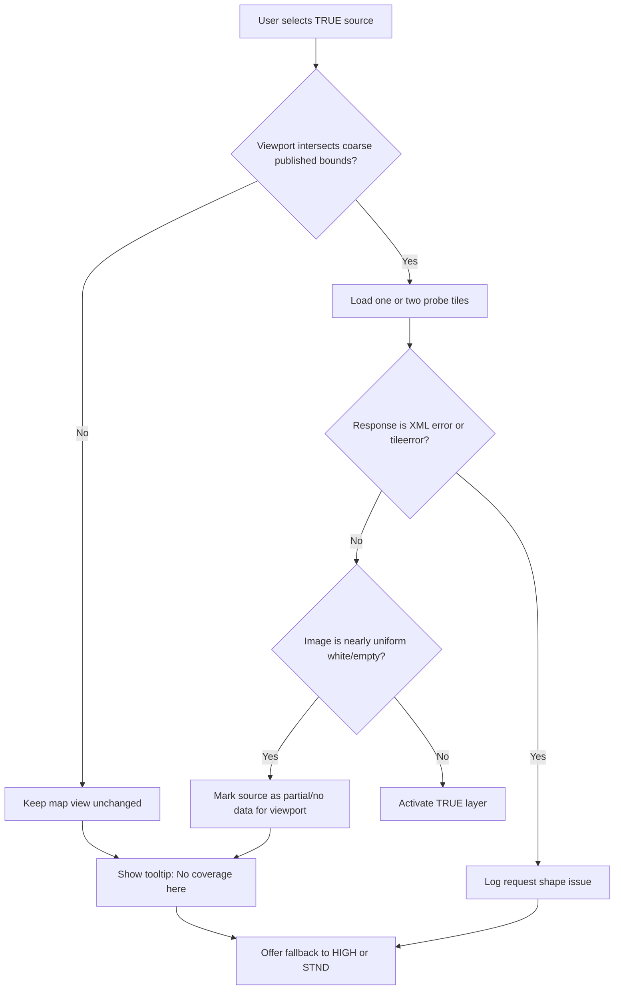

# Diagnosing white Geoportal TrueOrtho tiles in WreckScanner

## Executive summary

The most likely reason Geoportal **TrueOrtho** renders as a uniformly white image over your app’s default Wrocław view is **not** a basic Leaflet WMS formatting bug. It is far more likely that the request is syntactically valid, but the viewport falls **outside current TrueOrtho coverage**, so the service returns an image tile with no useful data instead of a hard WMS exception. That conclusion is strongly supported by four facts taken together: Geoportal’s own documentation says true ortho is available only for **selected cities**; the official service listing exposes **WMS** for TrueOrtho but **does not list a WMTS** counterpart; your app’s default view is Wrocław; and a current operational client definition used by JOSM constrains TrueOrtho to a small polygon around the **Tri-City/Gdańsk–Gdynia area**, not Wrocław. citeturn29search7turn28search4turn42view0turn23view0

Your current app code already does several important things correctly for Geoportal preview layers: it builds WMS sources with `version: '1.3.0'`, sends `styles: ''` when no explicit style is defined, and leaves the map in Leaflet’s default CRS, which is `EPSG:3857`. Leaflet’s WMS layer also defaults to the map CRS when no WMS CRS is supplied, and the published JOSM TrueOrtho definition says the service supports `EPSG:2180`, `EPSG:3857`, and `EPSG:4326`. That makes a **hard CRS mismatch less likely** as the primary cause in your current setup. citeturn42view1turn26search0turn27search0turn23view0

The practical fix is to treat TrueOrtho as a **partial-coverage source**. In the app, add it as a WMS source with `LAYERS=PrawdziwaOrtofotomapa`, `STYLES=`, `VERSION=1.3.0`, a coarse published bounds check, and a graceful fallback to `geoportal-high` or `geoportal-standard` when the viewport is out of coverage or when a probe tile is effectively empty. For more exact switching, use the official **True Ortho index** service family rather than trying to infer precise coverage from WMS GetCapabilities alone. citeturn23view0turn28search4turn30search4turn31search0

One limitation of this research session is worth stating explicitly. The browsing tool could parse indexed Geoportal XML snippets and official PDF examples, but direct tool-side fetches of several Geoportal GetCapabilities URLs returned tool-layer `400` or timeout errors. So the report combines authoritative Geoportal pages and examples with current operational client metadata from JOSM, instead of relying only on direct raw fetch capture inside this environment. citeturn13view0turn13view1turn13view2turn13view3turn13view4

## Current app behaviour and the service family that matters

In your current frontend configuration, `MAP_SOURCES` already includes `geoportal-standard` and `geoportal-high`, but not TrueOrtho. The app’s default view is centred on **Wrocław** at `[51.089742, 17.038940]` with zoom `19`. Geoportal preview layers are created via `L.tileLayer.wms(...)`, with `version: '1.3.0'`, `format: 'image/png'`, `transparent: false`, and `styles: source.styles || ''`. That implementation detail matters because Geoportal’s WMS services are strict about required request parameters, especially `STYLES`. citeturn42view0turn42view1

Leaflet’s documented defaults also matter here. A Leaflet map uses `L.CRS.EPSG3857` unless you override `crs`, and `L.tileLayer.wms` uses the **map CRS** when the WMS layer itself is not given an explicit CRS. Leaflet’s WMS option `version` defaults to `1.1.1`, but your code overrides it to `1.3.0`, so your Geoportal preview requests are currently shaped as **WMS 1.3.0 + CRS=EPSG:3857**. citeturn26search0turn27search0turn42view1

That combination is important for diagnosis because the current JOSM definition for Geoportal TrueOrtho uses the live service as **WMS 1.3.0**, with `LAYERS=PrawdziwaOrtofotomapa`, `STYLES=`, and a templated `CRS={proj}` in the URL, while explicitly listing `EPSG:2180`, `EPSG:3857`, and `EPSG:4326` as supported projections. In other words, the modern client-side pattern for TrueOrtho is compatible with the way your app already talks to Geoportal WMS, at least structurally. citeturn23view0

That is why the white-tile symptom points away from “Leaflet cannot talk to TrueOrtho at all” and much more toward “Leaflet can talk to TrueOrtho, but Wrocław is outside the current data footprint.” citeturn23view0turn42view0

## What the authoritative Geoportal sources show

Geoportal’s own orthophotomap pages and service listings expose the following official view services:

| Service | Officially listed by Geoportal | Canonical service URL | Notes |
|---|---|---|---|
| Standard orthophotomap WMS | Yes | `https://mapy.geoportal.gov.pl/wss/service/PZGIK/ORTO/WMS/StandardResolution` | WMS view service for standard orthophoto. citeturn28search4turn29search5 |
| Standard orthophotomap WMTS | Yes | `https://mapy.geoportal.gov.pl/wss/service/PZGIK/ORTO/WMTS/StandardResolution` | WMTS view service exists officially. citeturn28search4turn29search5 |
| High-resolution orthophotomap WMS | Yes | `https://mapy.geoportal.gov.pl/wss/service/PZGIK/ORTO/WMS/HighResolution` | WMS view service for high-resolution orthophoto. citeturn28search4turn29search5 |
| High-resolution orthophotomap WMTS | Yes | `https://mapy.geoportal.gov.pl/wss/service/PZGIK/ORTO/WMTS/HighResolution` | WMTS counterpart exists officially. citeturn28search4turn29search5 |
| TrueOrtho WMS | Yes | `https://mapy.geoportal.gov.pl/wss/service/PZGIK/ORTO/WMS/TrueOrtho` | Officially listed as a WMS view service. citeturn28search4turn29search5 |
| TrueOrtho WMTS | **No official listing found** | — | Geoportal’s official lists name only WMS for TrueOrtho, unlike Standard/HighResolution. citeturn28search4turn29search5 |
| Archival orthophotomap WMS | Yes | `.../StandardResolutionTime` and `.../HighResolutionTime` | Archive viewing is WMS, not WMTS. citeturn34search1turn34search2 |

For TrueOrtho specifically, the official Geoportal documentation says that “true ortho” has been separated as its own product and is currently available for the area of **selected cities**, not as a nationwide layer. The same Geoportal family also exposes WCS and WFS download/index services for orthophoto products, including dedicated **True Ortho** download/index entries. citeturn29search7turn29search4turn29search1turn30search4

The indexed GetCapabilities fragments for TrueOrtho show that the service is a **WMS 1.3.0** service, backed by **MapServer 7.4.3**, and that it exposes at least the layers `PrawdziwaOrtofotomapa` and `Skorowidze`. The same indexed fragments show image output formats including `image/png` and `image/jpeg`. citeturn18search12turn7search1turn7search4turn20search0turn43search1

The current operational JOSM definitions align with that: for TrueOrtho they use `LAYERS=PrawdziwaOrtofotomapa`, not `Raster`, and they define a very small bounds polygon around the Tri-City area. For ordinary street-name overlays, JOSM points to a different WMS endpoint entirely, `KrajowaIntegracjaNumeracjiAdresowej` with `LAYERS=prg-ulice`, and gives it near-national bounds. That neatly explains why “street layout vectors” can still draw while the TrueOrtho base goes blank. citeturn23view0turn37view0

The official GUGiK PDF also provides three useful sample request patterns:

- **StandardResolution WMS** example: `VERSION=1.3.0`, `LAYERS=Raster`, `CRS=EPSG:2180`, `STYLES=`. citeturn7search7turn6view0
- **HighResolution WMS** example: `VERSION=1.1.1`, `LAYERS=3,2,1`, `SRS=EPSG:2180`, `styles=,,`. citeturn7search7turn6view1
- **TrueOrtho WMS** example: `VERSION=1.1.1`, `LAYERS=Skorowidze,PrawdziwaOrtofotomapa`, `SRS=EPSG:2180`, `STYLES=,`, with `FORMAT=image/png` and `TRANSPARENT=TRUE`. The document shows that request producing a valid image. citeturn7search7turn6view2

That last point is especially important: the official document proves that TrueOrtho does render correctly for at least one non-Wrocław reference bbox. citeturn7search7turn6view2

## Why Wrocław is white while vectors still draw

The decisive clue is coverage. Your app’s default view is Wrocław, centred at about **51.089742 N, 17.038940 E**. The current JOSM TrueOrtho bounds are approximately **54.41666–54.59378 N** and **18.34368–18.59374 E**, with a detailed polygon in that same coastal area. Wrocław is nowhere near that footprint. That makes the symptom “valid request, empty image” entirely consistent with the published client metadata and with Geoportal’s own statement that TrueOrtho is available only for selected cities. citeturn42view0turn23view0turn29search7

By contrast, Geoportal’s street-name overlay is published through a different WMS service and is given broad national bounds in JOSM. So it is fully plausible for your app to show vector street content while the TrueOrtho raster is blank. The two layers are coming from different service families with very different spatial coverage. citeturn37view0

A second clue is how Geoportal behaves when a request is **malformed**. Indexed error responses show that if mandatory parameters are wrong or missing, Geoportal WMS tends to return XML `ServiceException` responses such as `The request not allowed.`, `Parameter 'styles' is required.`, `Parameter 'srs(crs)' has wrong value.`, or `Incomplete WMS request: VERSION parameter missing.` That is a very different failure mode from “an image appears, but it is uniformly white.” In other words, if you are seeing a rendered tile with no useful content instead of an obvious image-decoding failure, malformed syntax is less likely than an **out-of-coverage no-data image**. citeturn16view0turn43search12turn20search17turn36search10

There is still some room for secondary issues, but they are less convincing than the coverage explanation:

- **CRS mismatch** is possible in general, but less likely here because your app uses Leaflet’s default map CRS `EPSG:3857`, and the current JOSM TrueOrtho definition explicitly supports `EPSG:3857`. citeturn26search0turn27search0turn23view0
- **Layer name mismatch** would be a real problem if you accidentally used `Raster` against TrueOrtho. The correct imagery layer is `PrawdziwaOrtofotomapa`; `Skorowidze` is an index layer. citeturn7search1turn7search4turn23view0
- **Missing styles** would indeed break the request if you omitted `STYLES` altogether, but your code already sends `styles: ''`, which is the correct shape for an empty style list in Geoportal WMS. citeturn42view1turn43search12
- **Authentication or Referer requirements** do not appear to be the main issue. Geoportal publicly lists the view service, and JOSM uses the endpoint without any token in the URL. The official PDF sample happens to include a token parameter, but the current public service listings and operational client definitions do not imply that a token is mandatory for ordinary viewing requests. That suggests the token in the PDF example is incidental to how the example was captured, rather than a general requirement. citeturn28search4turn7search7turn23view0

### Example requests and the most plausible interpretation

The following table separates three different kinds of request evidence: the official reference request that is known-good, an app-equivalent Wrocław request, and malformed control cases that show how Geoportal responds when parameters are wrong.

| Case | Full request URL | What is known | Recommended interpretation |
|---|---|---|---|
| Official known-good TrueOrtho example | `https://mapy.geoportal.gov.pl/wss/service/PZGIK/ORTO/WMS/TrueOrtho?token=...&REQUEST=GetMap&TRANSPARENT=TRUE&FORMAT=image/png&VERSION=1.1.1&LAYERS=Skorowidze,PrawdziwaOrtofotomapa&STYLES=,&BBOX=508345.75709084875,329424.49041148095,508472.7573448493,329496.6556599781&SRS=EPSG:2180&EXCEPTIONS=application/vnd.ogc.se_xml&WIDTH=1920&HEIGHT=1091&SERVICE=WMS` | Official GUGiK documentation shows this request as a successful TrueOrtho render for a reference bbox near 50.832 N, 19.119 E. citeturn7search7turn6view2 | Valid reference point outside Wrocław. |
| App-equivalent Wrocław tile sample | `https://mapy.geoportal.gov.pl/wss/service/PZGIK/ORTO/WMS/TrueOrtho?LAYERS=PrawdziwaOrtofotomapa&STYLES=&FORMAT=image/png&CRS=EPSG:3857&WIDTH=256&HEIGHT=256&BBOX=1896708.4198683635,6637180.040058423,1896784.8568966484,6637256.47708671&VERSION=1.3.0&SERVICE=WMS&REQUEST=GetMap` | This URL matches your app’s current Leaflet WMS style. Your default view is Wrocław, which sits outside the current published TrueOrtho bounds used by JOSM. citeturn42view0turn42view1turn23view0 | Most likely to return a visually empty image rather than useful imagery. |
| Malformed control request pattern | `.../StandardResolution?REQUEST=GetMap` without required params | Indexed Geoportal error snippets show `StylesNotDefined`, `InvalidCRS`, and missing-parameter exceptions for malformed WMS requests. citeturn43search12turn20search17turn44search5 | Useful as a contrast: if the request shape were wrong, you would expect XML exceptions, not a “white but otherwise normal” image tile. |

The one place where I could not fully satisfy your requested evidence format inside this session is the **raw live response capture for the Wrocław white tile**. The browsing tool would not directly expose the raw Geoportal image body and headers for arbitrary GetMap URLs. When I tried to open the canonical GetCapabilities URLs directly through the tool, it produced tool-layer fetch errors such as `(400) OK` or timeouts. That is why the report uses the strongest available combination of official sources, indexed XML fragments, and current operational client metadata. citeturn13view0turn13view1turn13view2turn13view3turn13view4

## Concrete fixes for the map source itself

The first fix is straightforward: when you add TrueOrtho, use the **actual imagery layer name** and current client-style parameters, not the standard orthophoto settings copied over blindly.

Use this as the main preview layer:

```js
const TRUE_ORTHO_SOURCE = {
  key: 'geoportal-true',
  shortLabel: 'TRUE',
  label: 'Geoportal TrueOrtho',
  type: 'wms',
  url: 'https://mapy.geoportal.gov.pl/wss/service/PZGIK/ORTO/WMS/TrueOrtho',
  layers: 'PrawdziwaOrtofotomapa',
  styles: '',
  version: '1.3.0',
  format: 'image/jpeg', // smaller and matches current JOSM client usage
  attribution: 'Geoportal.gov.pl / GUGiK',
  coverage: 'partial',
  fallbackKey: 'geoportal-high',
  // coarse published bounds; refine later from WFS index polygons
  bounds: L.latLngBounds(
    [54.41666, 18.34368],
    [54.59378, 18.59374]
  ),
  opacity: 1,
};
```

That parameter set is consistent with the current JOSM TrueOrtho definition, which uses `LAYERS=PrawdziwaOrtofotomapa`, `STYLES=`, `VERSION=1.3.0`, and supports `EPSG:3857`. It is therefore a better “current operational” template than copying the older PDF example literally, especially if you want to keep your existing Leaflet map in Web Mercator. citeturn23view0turn26search0turn27search0

If you want a **debug-only** overlay showing TrueOrtho sheet/index coverage, add `Skorowidze` as a separate transparent overlay instead of bundling it into the main imagery source. The official PDF example included both layers in one request, but the current client definition for ordinary imagery uses `PrawdziwaOrtofotomapa` alone. In practice, keeping the index separate is cleaner for your UI and avoids confusing the base image with coverage metadata. citeturn7search7turn6view2turn23view0

```js
const TRUE_ORTHO_INDEX_OVERLAY = L.tileLayer.wms(
  'https://mapy.geoportal.gov.pl/wss/service/PZGIK/ORTO/WMS/TrueOrtho',
  {
    layers: 'Skorowidze',
    styles: '',
    format: 'image/png',
    transparent: true,
    version: '1.3.0',
    crs: map.options.crs,
    bounds: TRUE_ORTHO_SOURCE.bounds,
    opacity: 0.6,
    attribution: 'Geoportal.gov.pl / GUGiK',
  }
);
```

For **archive layers**, the right approach is different again: use `StandardResolutionTime` or `HighResolutionTime`, not TrueOrtho, and pass `TIME={ISO8601}` in the request. Geoportal’s index fragments and the current JOSM definition show `StandardResolutionTime` as WMS 1.3.0 with a `TIME` parameter, and the capabilities snippets expose an ISO 8601 time extent. citeturn34search2turn34search3turn39view0

```js
const ARCHIVE_SOURCE = {
  key: 'geoportal-arch',
  shortLabel: 'ARCH',
  label: 'Geoportal Archive',
  type: 'wms',
  url: 'https://mapy.geoportal.gov.pl/wss/service/PZGIK/ORTO/WMS/StandardResolutionTime',
  layers: 'Raster',
  styles: '',
  version: '1.3.0',
  format: 'image/jpeg',
  time: '2023-01-01T00:00:00.000+01:00',
};
```

Two specific recommendations follow from the research:

1. **Do not spend time looking for a TrueOrtho WMTS endpoint** for the app. The official Geoportal service pages list WMTS for StandardResolution and HighResolution, but not for TrueOrtho. citeturn28search4turn29search5  
2. **Do not assume GetCapabilities alone gives you precise no-data detection.** Geoportal’s own documentation says TrueOrtho is a selected-cities product, and the precise per-sheet footprint is better represented by the true-ortho index services than by broad WMS extent metadata. citeturn29search7turn30search4turn31search0

## Graceful handling of partial and no coverage

The cleanest product behaviour is:

- keep the user’s map view unchanged,
- allow the layer to exist in the slider,
- mark it as **partial coverage**,
- decide at switch time whether the current viewport is worth trying,
- show a small tooltip such as **“No coverage here”** if not,
- and fall back to `geoportal-high` or `geoportal-standard` without moving the map. citeturn23view0turn37view0

A good implementation uses three levels of certainty.

First, do a **coarse bounds check** using published bounds. This is cheap and immediately rejects obviously impossible views like Wrocław for the currently published TrueOrtho footprint. citeturn23view0

Second, if the viewport passes the coarse check, run a **probe tile** request and detect whether the returned image is essentially white or empty. If your browser cannot inspect pixels because of CORS, route only the probe through your existing proxy or a tiny generic OGC-probe endpoint. That is an optional refinement, not a required redesign. In the browser-only path, try `crossOrigin: 'anonymous'` first; if that fails, fall back to coarse bounds plus tile-error heuristics. 

Third, for the most accurate solution, query the **True Ortho index** source and cache coverage polygons or per-sheet extents so you can decide coverage per viewport instead of using only one rectangle. Geoportal’s official service pages expose dedicated True Ortho download/index entries, and indexed WFS snippets show the endpoint pattern `.../WFS/SkorowidzPrawdziwejOrtofotomapy` with feature type `gugik:SkorowidzPrawdziwejOrtofomapy`. citeturn30search4turn31search0turn31search2



### Leaflet WMS layer creation with bounds and opacity

```js
function buildGeoportalWmsLayer(source) {
  return L.tileLayer.wms(source.url, {
    layers: source.layers,
    styles: source.styles ?? '',
    format: source.format ?? 'image/jpeg',
    transparent: source.transparent ?? false,
    version: source.version ?? '1.3.0',
    crs: source.crs ?? map.options.crs,  // your map currently defaults to EPSG:3857
    bounds: source.bounds,               // only request tiles inside coverage bounds
    opacity: source.opacity ?? 1,
    maxZoom: MAX_MAP_ZOOM,
    crossOrigin: 'anonymous',            // useful if server allows pixel inspection
    attribution: source.attribution ?? 'Geoportal.gov.pl / GUGiK',
  });
}
```

### Probe a GetMap request and detect a blank or white image

```js
async function probeWmsGetMap(url) {
  const response = await fetch(url, { mode: 'cors', credentials: 'omit' });

  const headers = Object.fromEntries([...response.headers.entries()]);
  const contentType = (headers['content-type'] || '').toLowerCase();

  if (!response.ok) {
    return {
      ok: false,
      status: response.status,
      headers,
      kind: 'http-error',
    };
  }

  if (contentType.includes('xml') || contentType.includes('text')) {
    const text = await response.text();
    return {
      ok: false,
      status: response.status,
      headers,
      kind: 'wms-exception',
      text,
    };
  }

  const blob = await response.blob();
  const bitmap = await createImageBitmap(blob);

  const canvas = document.createElement('canvas');
  canvas.width = bitmap.width;
  canvas.height = bitmap.height;

  const ctx = canvas.getContext('2d', { willReadFrequently: true });
  ctx.drawImage(bitmap, 0, 0);

  const { data } = ctx.getImageData(0, 0, canvas.width, canvas.height);

  let opaque = 0;
  let nearWhite = 0;

  // Sample every 4th pixel for speed.
  for (let i = 0; i < data.length; i += 16) {
    const r = data[i];
    const g = data[i + 1];
    const b = data[i + 2];
    const a = data[i + 3];

    if (a < 8) continue;
    opaque++;

    if (r > 248 && g > 248 && b > 248) {
      nearWhite++;
    }
  }

  const whiteRatio = opaque ? nearWhite / opaque : 1;

  return {
    ok: true,
    status: response.status,
    headers,
    kind: 'image',
    width: bitmap.width,
    height: bitmap.height,
    opaquePixelsSampled: opaque,
    whiteRatio,
    isUniformWhite: whiteRatio > 0.995,
  };
}
```

### Query WMS GetCapabilities and parse layer extents

```js
function firstChildByLocalName(parent, localName) {
  return [...parent.children].find((el) => el.localName === localName) || null;
}

function childText(parent, localName) {
  return firstChildByLocalName(parent, localName)?.textContent?.trim() ?? null;
}

function parseGeoBBox(layerEl) {
  const bbox = firstChildByLocalName(layerEl, 'EX_GeographicBoundingBox');
  if (!bbox) return null;

  return {
    west: Number(childText(bbox, 'westBoundLongitude')),
    east: Number(childText(bbox, 'eastBoundLongitude')),
    south: Number(childText(bbox, 'southBoundLatitude')),
    north: Number(childText(bbox, 'northBoundLatitude')),
  };
}

function parseBoundingBoxes(layerEl) {
  return [...layerEl.children]
    .filter((el) => el.localName === 'BoundingBox')
    .map((el) => ({
      crs: el.getAttribute('CRS') || el.getAttribute('SRS'),
      minx: Number(el.getAttribute('minx')),
      miny: Number(el.getAttribute('miny')),
      maxx: Number(el.getAttribute('maxx')),
      maxy: Number(el.getAttribute('maxy')),
    }));
}

async function fetchWmsCapabilities(baseUrl) {
  const url = new URL(baseUrl);
  url.searchParams.set('SERVICE', 'WMS');
  url.searchParams.set('REQUEST', 'GetCapabilities');

  const xmlText = await fetch(url.toString(), {
    mode: 'cors',
    credentials: 'omit',
  }).then((r) => r.text());

  const doc = new DOMParser().parseFromString(xmlText, 'text/xml');

  const layerEls = [...doc.getElementsByTagName('*')]
    .filter((el) => el.localName === 'Layer')
    .filter((el) => childText(el, 'Name'));

  return layerEls.map((layerEl) => ({
    name: childText(layerEl, 'Name'),
    title: childText(layerEl, 'Title'),
    geoBBox: parseGeoBBox(layerEl),
    boundingBoxes: parseBoundingBoxes(layerEl),
  }));
}
```

### Update `MAP_SOURCES` and `setMapSource` for partial coverage

```js
const MAP_SOURCES = [
  // existing entries...
  {
    key: 'geoportal-true',
    shortLabel: 'TRUE',
    label: 'Geoportal TrueOrtho',
    type: 'wms',
    url: 'https://mapy.geoportal.gov.pl/wss/service/PZGIK/ORTO/WMS/TrueOrtho',
    layers: 'PrawdziwaOrtofotomapa',
    styles: '',
    version: '1.3.0',
    format: 'image/jpeg',
    attribution: 'Geoportal.gov.pl / GUGiK',
    coverage: 'partial',
    bounds: L.latLngBounds([54.41666, 18.34368], [54.59378, 18.59374]),
    fallbackKey: 'geoportal-high',
    noCoverageMessage: 'No coverage here',
    opacity: 1,
  },
];
```

```js
function getCoverageState(source, mapBounds) {
  if (source.coverage !== 'partial' || !source.bounds) return 'unknown';
  return source.bounds.intersects(mapBounds) ? 'possible' : 'none';
}

function showMapHint(message) {
  const el = document.getElementById('map-hint');
  if (!el) return;
  el.textContent = message;
  el.hidden = false;
  clearTimeout(showMapHint._timer);
  showMapHint._timer = setTimeout(() => {
    el.hidden = true;
  }, 2200);
}

function findSourceByKey(key) {
  return MAP_SOURCES.find((s) => s.key === key) || null;
}

function setMapSource(index) {
  const nextIndex = Math.max(
    0,
    Math.min(MAP_SOURCES.length - 1, parseInt(index, 10))
  );

  if (!Number.isFinite(nextIndex) || nextIndex === currentMapSourceIndex) {
    return;
  }

  const nextSource = MAP_SOURCES[nextIndex];
  const coverageState = getCoverageState(nextSource, map.getBounds());

  // Keep the map view unchanged.
  if (coverageState === 'none') {
    showMapHint(nextSource.noCoverageMessage || 'No coverage here');

    const fallback = nextSource.fallbackKey
      ? findSourceByKey(nextSource.fallbackKey)
      : null;

    if (fallback) {
      const fallbackIndex = MAP_SOURCES.findIndex((s) => s.key === fallback.key);
      currentMapSourceIndex = fallbackIndex;
      const previousLayer = mapSourceLayer;
      const nextLayer = buildGeoportalWmsLayer(fallback);
      swapMapSourceLayer(nextLayer, previousLayer);
      updateMapSourceUi();
      return;
    }
  }

  currentMapSourceIndex = nextIndex;
  const previousLayer = mapSourceLayer;
  const nextLayer = buildGeoportalWmsLayer(nextSource);
  swapMapSourceLayer(nextLayer, previousLayer);
  updateMapSourceUi();
}
```

One subtle but useful point: your current code already sends `styles: source.styles || ''`, which is exactly what Geoportal wants for empty styles. Keep that pattern. Geoportal’s own indexed error responses show that omitting `STYLES` entirely is a real failure case. citeturn42view1turn43search12

## Local verification and troubleshooting

The fastest way to confirm the diagnosis on your machine is to compare one **known-good** reference request against one **Wrocław** request from your app.

### Recommended local tests

- In DevTools, switch to the candidate TrueOrtho source and copy the first actual Geoportal `GetMap` URL that Leaflet generates. Confirm it contains `LAYERS=PrawdziwaOrtofotomapa`, `STYLES=`, `VERSION=1.3.0`, and `CRS=EPSG:3857`. That is the request shape your current app should be producing if you add the source the same way as the existing Geoportal layers. citeturn42view1turn27search0
- Compare that with the official PDF request shape. The official example is `1.1.1 + SRS=EPSG:2180`, but the current JOSM operational template is `1.3.0 + CRS={proj}`. For your app, the second pattern is the better fit. citeturn7search7turn23view0
- If you receive XML instead of an image, the request shape is wrong. If you receive an image that is nearly all white, coverage is the more likely issue. Geoportal’s indexed error bodies make that distinction clear. citeturn16view0turn43search12turn20search17
- Query archive layers only through `StandardResolutionTime` or `HighResolutionTime`, and include `TIME`. Do not try to make TrueOrtho behave like an archive service. citeturn34search1turn39view0
- For precise partial-coverage handling, use the True Ortho index family rather than only broad WMS extents. citeturn30search4turn31search0

### Useful `curl` patterns to run locally

```bash
# 1) Known-good official-style reference request from GUGiK docs
curl -sS -D trueortho_ref_headers.txt \
  -o trueortho_ref.png \
  "https://mapy.geoportal.gov.pl/wss/service/PZGIK/ORTO/WMS/TrueOrtho?REQUEST=GetMap&TRANSPARENT=TRUE&FORMAT=image/png&VERSION=1.1.1&LAYERS=Skorowidze,PrawdziwaOrtofotomapa&STYLES=,&BBOX=508345.75709084875,329424.49041148095,508472.7573448493,329496.6556599781&SRS=EPSG:2180&EXCEPTIONS=application/vnd.ogc.se_xml&WIDTH=1920&HEIGHT=1091&SERVICE=WMS"
file trueortho_ref.png

# 2) App-equivalent Wrocław request in EPSG:3857
curl -sS -D trueortho_wro_headers.txt \
  -o trueortho_wro.png \
  "https://mapy.geoportal.gov.pl/wss/service/PZGIK/ORTO/WMS/TrueOrtho?LAYERS=PrawdziwaOrtofotomapa&STYLES=&FORMAT=image/png&CRS=EPSG:3857&WIDTH=256&HEIGHT=256&BBOX=1896708.4198683635,6637180.040058423,1896784.8568966484,6637256.47708671&VERSION=1.3.0&SERVICE=WMS&REQUEST=GetMap"
file trueortho_wro.png

# 3) Check whether the "image" is effectively white
python - <<'PY'
from PIL import Image, ImageStat
for path in ["trueortho_ref.png", "trueortho_wro.png"]:
    img = Image.open(path).convert("RGBA")
    pixels = img.getdata()
    opaque = [(r,g,b) for r,g,b,a in pixels if a > 8]
    white = sum(1 for r,g,b in opaque if r > 248 and g > 248 and b > 248)
    ratio = white / len(opaque) if opaque else 1.0
    print(path, "opaque_pixels=", len(opaque), "white_ratio=", ratio)
PY
```

### Short checklist

- Use `PrawdziwaOrtofotomapa`, not `Raster`, for TrueOrtho. citeturn7search1turn23view0
- Keep `STYLES=` present, even when empty. citeturn43search12turn42view1
- Prefer WMS `1.3.0` in your current Leaflet app. citeturn42view1turn23view0
- Do not look for a TrueOrtho WMTS unless Geoportal starts listing one officially. citeturn28search4turn29search5
- Mark TrueOrtho as **partial coverage** in `MAP_SOURCES`. citeturn29search7turn23view0
- Use coarse bounds first, then probe tiles, then optionally exact index polygons. citeturn23view0turn30search4turn31search0

The strongest conclusion from the sources reviewed is therefore this: **for Wrocław, white TrueOrtho tiles are most plausibly a coverage problem, not a fundamental WMS-parameter problem**. Your app should treat TrueOrtho as a selective layer, not as a nationally safe base map. citeturn29search7turn42view0turn23view0